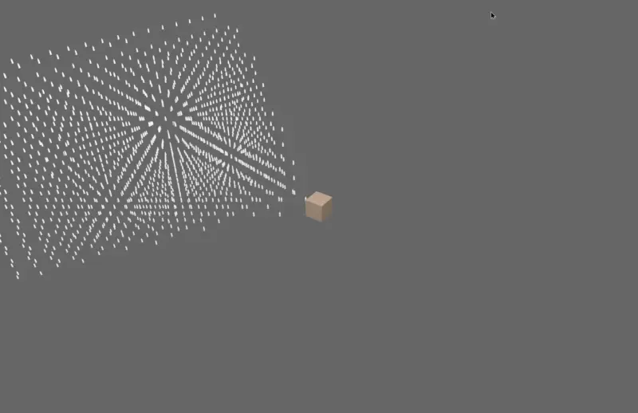

# bevy_frustum_culling

Bevy plugin for frustum culling. See the examples/demo.rs for usage. Requires the aevyrie/bevy_mod_bounding plugin to generate bounding volumes for your meshes, as shown in the demo.
